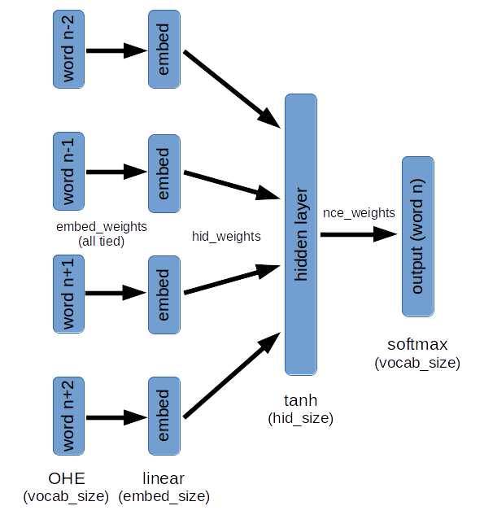
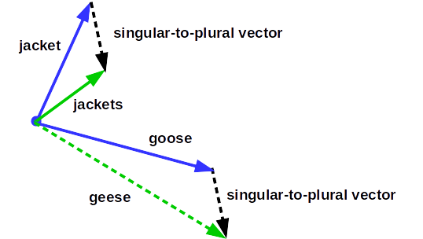

# Overview

My primary objective with this project was to learn [TensorFlow](https://www.tensorflow.org/). I've previously used [Keras](https://keras.io/) with TensorFlow as its back-end. Recently, Keras couldn't easily build the neural net architecture I wanted to try. So it was time to learn the TensorFlow API.

I chose to build a simple word-embedding neural net. This seemed a good compromise that was interesting, but not too complex. I didn't want to simultaneously debug my neural net and my TensorFlow code.

# Word Vectors

A word vector is just a n-dimensional, real-valued vector representation of a word. Word vectors for 2 similar words should be close to each other using some distance metric. For instance, you would expect "jacket" and "coat" to be close to each other. Similarly, you would expect "jacket" and "jackets" to be close.

However, "jacket" is singular and "jackets" is plural, so we would expect some difference in the vectors. Easy, the word with a "s" at the end is plural. But, what about "mouse" and "mice" or "goose" and "geese"? Who wants to teach a computer all of the bizarre rules of English? Then repeat the task for Spanish, German, French and so on. Can we learn word vectors without human-labeled data?

# Unsupervised Learning

Learning word vectors from documents is a nice way to see the power of unsupervised learning. It can be counter-intuitive that a machine can learn without human-labeled data. At first, I associated unsupervised learning with k-means clustering, and not much else. While clustering is useful, it hardly seems exciting.

The *Big Idea* is to learn the structure in your data *before* using your precious hand-labeled examples. Consider these two very different approaches:

1. Hire experts to label thousands of words in dozens of documents. Then set your learning algorithm loose and hope it will learn features that generalize. But, suppose your training didn't include "Angela Merkel". It is possible the model sees capital letters and figures out she is a person, but probably not much beyond that.
2. Train a model on **hundreds** of documents and **millions** of words. And bypass hiring human experts. Encourage the model to learn words that seem interchangeable. And learn patterns of words that occur together. And so forth. After this initial training, introduce a much smaller set of human-labeled data. Once you label one word, the model already knows its similarity and relationship to dozens of other words.
	* Example: We label "Angela Merkel" as "head of state" of "Germany". The model has seen Francois Hollande's name used similarly with respect to France. And Barack Obama with respect to the United States. So, by giving the model one example, it is able to deduce many more.

I hope this gives you some appreciation for the power of unsupervised learning. First, learn the structure and patterns ("regularities" in machine learning speak) from a large set set of data. Then, label a much smaller set of examples. Don't waste valuable hand-labeled data learning the basic structure of your data. This same approach applies to many domains, including speech and image recognition.

# Learning Word Vectors

There are many approaches to learning vector representations of words. The approach used here trains a model to predict the "middle" word given the N preceding and N following words. Here is a diagram of the model:

Here are a some key points:

* The weights from the input One-Hot-Encoding (OHE) to the embedding layer are all "tied". This means the same weight vector is used for input word(n-2) as word(n-1), and so forth. This forces the model to learn the same representation of an input word, regardless of its position.
* A softmax with the width of the entire vocabulary is not practical. [Noise Contrastive Estimation](https://www.cs.toronto.edu/~amnih/papers/wordreps.pdf) is used. Briefly, the target word and K-1 random words (drawn from a distribution roughly matching word frequencies) are used to calculate cross-entropy loss on each training example. This allows training to be done with a much smaller K-way softmax (I used K=64).
* There are 2 places in the model to grab learned word vectors from:
	1. The weights from the input OHE to the embedding layer
	2. The weights from the hidden layer to the softmax layer. It turns out, word vectors from here gave qualitatively more sensible results.

# Results

I trained the model using 3 Sherlock Holmes books (written by Sir Arthur Conan Doyle):

* The Hound of the Baskervilles
* The Sign of the Four
* The Adventures of Sherlock Holmes

Thanks to [Project Gutenberg](https://www.gutenberg.org/).

The total vocabulary size of these three books is 11,750 words. The total number of words is ~245,000. The model was trained using stochastic gradient descent (SGD) with momentum. I got better results using SGD with momentum than with either RMSProp or Adam optimizers ([see nice post explaining various optimization algorithms](http://sebastianruder.com/optimizing-gradient-descent/)). I used a batch size of 32, a learning rate of 0.01 and momentum of 0.9.

I constrained the word vectors to 64 dimensions. Word vectors with 128 dimensions had lower training and validation loss. But, forcing the model to learn a more economical (lower dimensionality) representation leads to more interesting (and perhaps more useful) results.

#### Word Similarity

Here I plugged in a word and found the 8 closest words based on cosine similarity to the learned word vectors.

**"seven" : ['eight', 'five', 'ten', 'eleven', 'twelve', 'six', 'four', 'nine']**

**"laughing" : ['smiling', 'rising', 'chuckling', "'and", 'wild', 'pensively', "'well", 'yawning']**

**"mr" : ['mrs', 'dr', "'mr", 'blind', 'earnestly', 'l', 'servant', 'st']**

Pretty amazing, I think. At the beginning of training, this model had no idea that "seven", "five" and "ten" were all numbers - they were just a meaningless jumble of letters to the computer. And now, having "read" only 3 Sherlock Holmes books, it learned these relationships.

#### Analogies

This diagram illustrates the approach to predicting analogies using word vectors:

The possibilities here are exciting. Again, we are using a model trained with no human-labeled examples. With a properly trained model, you can query: "Massachusetts" to "Boston" : "Colorado" to "?". You can reasonably expect to get "Denver" as the result (although not with the Sherlock Holmes training set).

Here are some actual results from the *Sherlock Holmes* training.

**had to has : was to** ['was', **'is'**, 'has', **'lives'**, 'makes']

**boot to boots : arm to** ['boots', **'arms'**, 'weeks', **'limbs'**, 'heart']

Not perfect, but the answers in the top-5 are certainly encouraging. (Even the 'lives' result in the first analogy is interesting.)

# The Code

The project has 2 major components:

* 3 Python modules to:
	1. Load and process text documents (docload.py)
	2. Build and train TensorFlow model (windowmodel.py)
	3. Explore the learned word vectors (wordvector.py)
* iPython Notebooks
	1. Load Sherlock Holmes books, train models and explore the results (sherlock.ipynb)
	2. Hyper-parameter tuning and viewing learning curves (tune\_\*.ipynb)
	3. Plot word frequencies (word\_frequency.ipynb)

I tried to write clear code for the 3 Python modules. I hope you find them useful for your own work, or just to better understand how to use TensorFlow.

For additional details on the code please see [README.md](https://github.com/pat-coady/word2vec/blob/master/README.md) on the GitHub page.



<noscript>Please enable JavaScript to view the <a href="https://disqus.com/?ref_noscript">comments powered by Disqus.</a></noscript>

